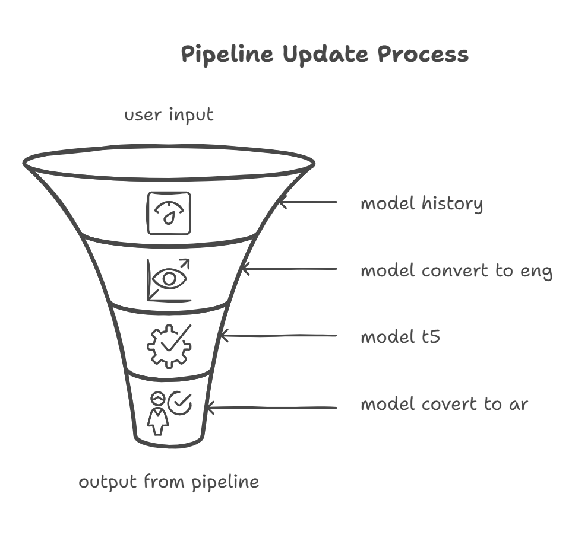

# Mental Therapy Chatbot

## Overview
This section provides details behind the scenes, explaining the model pipeline.

## Model Pipeline

The diagram illustrates the flow of user input through various stages of processing:
1. **Model History:** Tracks past interactions to maintain context.
2. **Model Conversion to English:** Converts input to English for processing if necessary.
3. **T5 Model Processing:** Processes the input using the fine-tuned T5 model.
4. **Model Conversion to Arabic:** Converts the response back to Arabic if required.
5. **Final Output:** Generates the chatbot's response based on the processed input.

For more details, refer to `t5-base.md`, `parameter.md`, and `model.md`.

