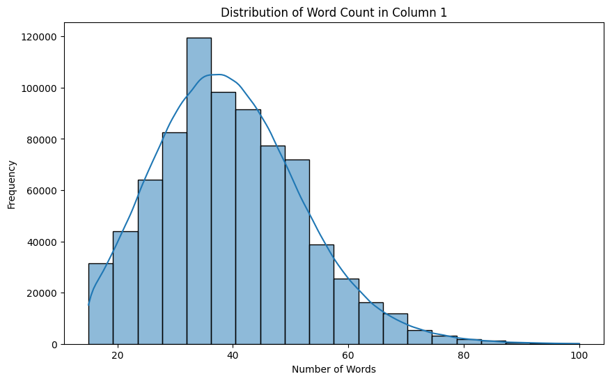
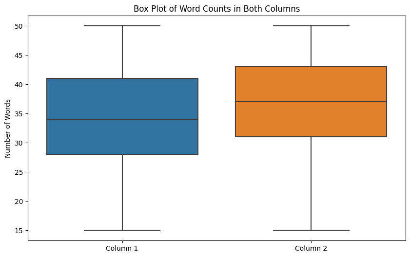

# Mental Therapy Chatbot

## Overview
This document highlights the most important parameters used in the model.

## Maximum and Minimum Length

Initially, I chose a maximum length of **150** words. However, this caused the model to generate incorrect sentences.  
To understand the issue, I analyzed the dataset.

-   
  The histogram illustrates the distribution of sentence lengths.  

-   
  The box plot shows the input and output sentence length distribution.  

From the data distribution, most sentences range between **20 to 80** words.  
Setting the max length to **150** was ineffective, so I adjusted it to **20 to 100** for better performance.

